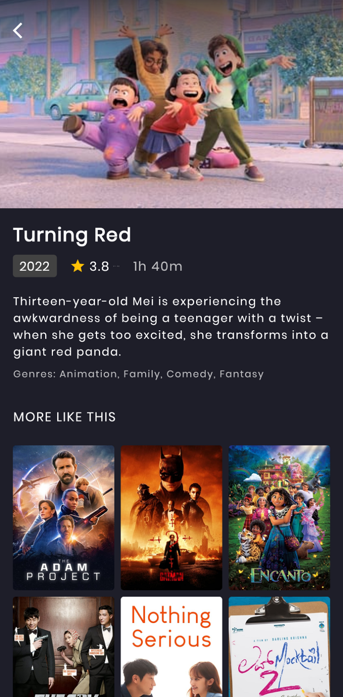

# 🎬 Movies App

This project is a Movies App built using Flutter, following the principles of Clean Architecture. The app allows users to browse, search, and view details of various movies. It is designed to be scalable, maintainable, and efficient.

## ✨ Features

- **Browse Movies**: View a list of popular movies with their posters, titles, and ratings.
- **Suggested Movie**: Get a suggestion for a movie to watch.
- **Popular Movies**: Browse a list of the most popular movies.
- **Highest-Rated Movies**: Browse a list of the highest-rated movies.
- **Movie Details**: See the rating, release year, and additional details about any movie.
- **Similar Movies**: View a list of movies similar to the one you are currently viewing.

## 📸 Screenshots

<div style="display: flex; justify-content: space-between; width: 100%;">
  
  
  
</div>

## 🛠️ Technologies Used

- **Flutter**: The primary framework for building the app.
- **Dart**: The programming language used.
- **Clean Architecture**: Organizes code into separate layers (Presentation, Domain, Data) to enhance maintainability and scalability.
- **State Management**: Efficient management of app state using reactive programming techniques.
- **Dependency Injection**: Improves testability and decoupling of code.

## 📚 Learning Outcomes

Through this project, I have gained practical experience in:

- Implementing Clean Architecture in a real-world Flutter application.
- Organizing code into different layers to separate concerns.
- Using dependency injection to manage dependencies.
- Applying state management techniques to build responsive and efficient UIs.
- Debugging, profiling, and optimizing Flutter applications for better performance.

## 📦 Packages Used

- **[animate_do](https://pub.dev/packages/animate_do)**: ^3.0.2
- **[cached_network_image](https://pub.dev/packages/cached_network_image)**: ^3.2.3
- **[carousel_slider](https://pub.dev/packages/carousel_slider)**: ^4.2.1
- **[cupertino_icons](https://pub.dev/packages/cupertino_icons)**: ^1.0.2
- **[dartz](https://pub.dev/packages/dartz)**: ^0.10.1
- **[dio](https://pub.dev/packages/dio)**: ^5.0.1
- **[equatable](https://pub.dev/packages/equatable)**: ^2.0.5
- **[flutter](https://flutter.dev)**: sdk: flutter
- **[flutter_bloc](https://pub.dev/packages/flutter_bloc)**: ^8.1.2
- **[get_it](https://pub.dev/packages/get_it)**: ^7.2.0
- **[google_fonts](https://pub.dev/packages/google_fonts)**: ^4.0.3
- **[shimmer](https://pub.dev/packages/shimmer)**: ^2.0.0

## 🚀 Getting Started

To get a local copy up and running, follow these steps:

### Prerequisites

- Flutter SDK: [Installation Guide](https://flutter.dev/docs/get-started/install)
- Dart SDK (included with Flutter)
- A code editor (VSCode, Android Studio, etc.)

### Installation

1. Clone the repo
   ```sh
   git clone https://github.com/your_username/movies_app.git
